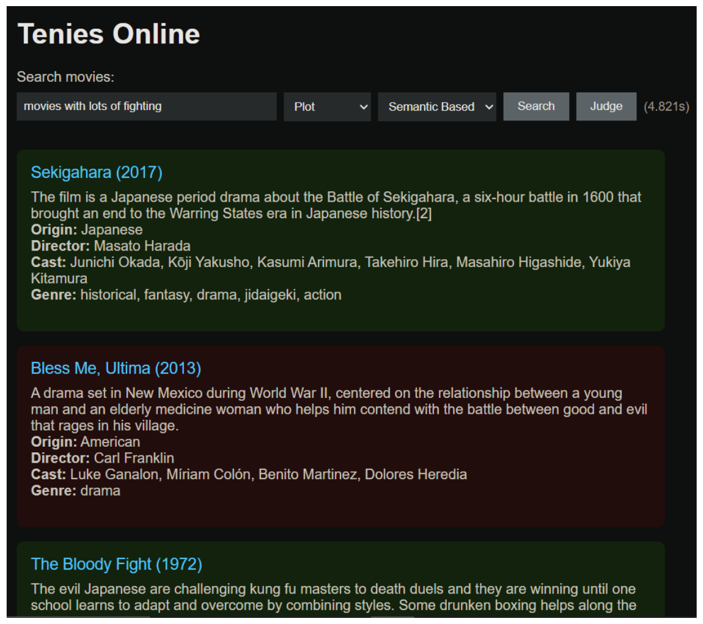
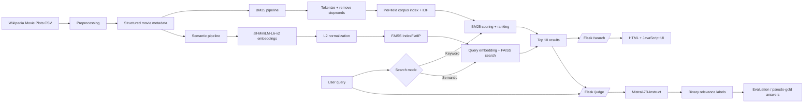
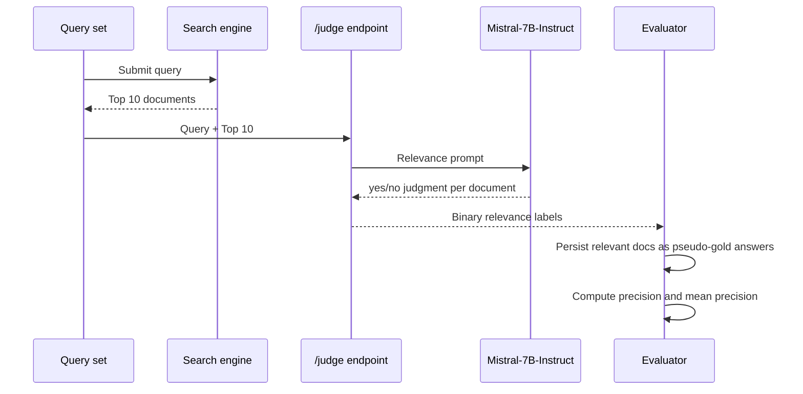

<div align="center">

# 🎬 Wikipedia Movie Plot Search Engine

### Dual-mode information retrieval with **BM25** and **SBERT + FAISS**

<p>
  
  
  
  
  
  
</p>

An end-to-end **IR & NLP course project** that indexes Wikipedia movie plots, retrieves and ranks the **top 10** results, compares lexical and semantic search, and evaluates both relevance and latency across **30 queries**.

</div>

---

## 🖥️ Demo

<p align="center">
  
</p>

The browser interface lets a user:

- enter a natural-language movie query;
- choose the metadata field to search;
- switch between **keyword-based BM25** and **semantic SBERT search**;
- inspect the **top 10 ranked movies** with their metadata;
- trigger an **LLM relevance judge** for the returned results.

> The screenshot above shows the query **“movies with lots of fighting”** using semantic search over movie plots. Green/red result cards visualize the relevance judgments returned by the evaluation pipeline.

---

## ✨ Project highlights

| | |
|---|---|
| 🔎 **Two retrieval paradigms** | Lexical **BM25** vs. semantic **Sentence-BERT** retrieval |
| 🧠 **Dense text representations** | `all-MiniLM-L6-v2` sentence embeddings |
| ⚡ **Vector indexing** | FAISS `IndexFlatIP` with L2-normalized vectors for cosine-style similarity |
| 🗂️ **Field-aware search** | Separate processing/indexing of movie metadata fields |
| 🧪 **Measured evaluation** | 30 queries, top-10 relevance evaluation, total retrieval latency |
| 🤖 **LLM-assisted judging** | `Mistral-7B-Instruct-v0.3` via Hugging Face API |
| 🌐 **Usable application** | Flask backend plus HTML/JavaScript search interface |
| 💾 **Reusable artifacts** | Embeddings, corpus indexes, IDF values, and FAISS indexes persisted to disk |

---

## 🏗️ System architecture



---

## 🔄 Retrieval pipeline

The project follows the full search-engine workflow required by the assignment:

### 1. Loading & preprocessing

The complete movie dataset is loaded with `pandas`, then transformed into a structured document collection:

- assigns a unique `doc_id` such as `doc_0`, `doc_1`, ...;
- converts values such as `unknown` into missing values;
- removes exact duplicates based on **movie title + release year**;
- extracts useful metadata such as title, plot, genre, director, cast, and origin;
- creates a combined text representation used by the evaluation pipeline.

### 2. Text representations

#### Semantic representation — SBERT

- model: **`all-MiniLM-L6-v2`**;
- text encoded in batches of **128**;
- embeddings generated separately for selected metadata fields;
- every embedding remains mapped to its original `doc_id`;
- generated embeddings are serialized to disk to avoid recomputation.

#### Lexical representation — BM25

- custom tokenization;
- stopword removal;
- per-field tokenized corpora;
- per-term **Inverse Document Frequency (IDF)** computation;
- corpus indexes and IDF values persisted to disk.

### 3. Indexing

For semantic retrieval:

1. stack the embeddings for each metadata field;
2. apply **L2 normalization**;
3. build a FAISS **`IndexFlatIP`** index;
4. use inner product over normalized vectors as cosine-style similarity;
5. save the index for reuse.

### 4. Retrieval & ranking

#### SBERT + FAISS

1. encode the query with the same sentence-transformer model;
2. normalize the query embedding;
3. search the relevant FAISS field index;
4. map returned vector positions back to `doc_id`s;
5. return the **10 highest-ranked documents**.

A slower fallback path also computes cosine similarity directly against all precomputed embeddings when FAISS is not used.

#### BM25

1. tokenize the query and remove stopwords;
2. score each document using term frequency, IDF, and document-length normalization;
3. sort scores in descending order;
4. return the **top 10** documents.

---

## ⚖️ Search methods compared

| Capability | BM25 | SBERT + FAISS |
|---|---|---|
| Retrieval type | Lexical / keyword | Dense semantic |
| Query representation | Tokens | Sentence embedding |
| Document representation | Tokenized corpus + IDF | Dense vectors |
| Matching strength | Exact / overlapping terms | Meaning and semantic similarity |
| Ranking | BM25 relevance score | Vector similarity |
| Acceleration | Precomputed corpus statistics | FAISS vector index |

This comparison was central to the project: the same movie collection can be searched using either traditional information retrieval or modern neural semantic retrieval.

---

## 🧪 Relevance evaluation

To evaluate the first 10 results for each query, I implemented an automated **LLM-as-a-judge** pipeline.



### Evaluation procedure

- The query and top 10 documents are inserted into a judging prompt.
- The prompt is sent to **Mistral-7B-Instruct-v0.3** through the Hugging Face API.
- The response is parsed into a binary relevance label for each result.
- Relevant results are stored as **pseudo-gold answers**.
- Retrieved results are compared against those labels using:

```text
Precision = TP / (TP + FP)
```

- Precision is averaged across the **30 evaluation queries**.

> **Methodological note:** these are LLM-generated relevance labels rather than human expert annotations. The pipeline is useful for scalable automated comparison, but a stronger future evaluation would add human judgments and ranking metrics such as nDCG or MRR.

---

## 📊 Benchmark results

Measured over **30 queries**:

| Retrieval configuration | Mean precision | Total time | Avg. time / query |
|---|---:|---:|---:|
| **SBERT (`all-MiniLM-L6-v2`) + FAISS** | **0.4667** | **2.073 s** | **69.1 ms** |
| SBERT brute-force similarity | 0.4667 | 8.674 s | 289.1 ms |
| BM25 | 0.4100 | 9.421 s | 314.0 ms |

### Key finding

> 🏆 **SBERT + FAISS was the strongest tested configuration**, combining the highest measured mean precision with the lowest total retrieval time.

FAISS made the semantic pipeline approximately **4.18× faster** than brute-force SBERT similarity in this 30-query benchmark. BM25 remained competitive in relevance despite being the simpler lexical baseline.

---

## 🌐 Flask API

### `/search`

Processes user queries in real time and:

- reads the selected search mode and metadata field;
- executes either BM25 ranking or semantic FAISS retrieval;
- returns the highest-ranked results;
- includes full movie metadata such as title, origin, director, cast, genre, and plot.

### `/judge`

Evaluates retrieved results by:

- sending the query and top 10 results to the LLM judge;
- receiving a yes/no relevance decision for each document;
- returning the documents together with their relevance labels.

---

## ▶️ Running the project

### 1. Dataset

Download the **Wikipedia Movie Plots** dataset:

`https://www.kaggle.com/datasets/jrobischon/wikipedia-movie-plots`

### 2. Optional LLM judge configuration

Create a `.env` file in the project root:

```env
HF_API_KEY=your_hugging_face_api_key
```

The key is required only for the Hugging Face relevance-judging pipeline.

### 3. Start the Flask server

```bash
python server.py
```

### 4. Start the main application

```bash
python main.py
```

> In the original project flow, `main.py` expects the Flask server to already be running.

---

## 🛠️ Technologies

`Python` · `pandas` · `Flask` · `Sentence Transformers` · `all-MiniLM-L6-v2` · `FAISS` · `BM25` · `NumPy` · `pickle` · `HTML` · `JavaScript` · `Hugging Face Inference API` · `Mistral-7B-Instruct-v0.3`

---

## 🚀 Possible improvements

- compare additional document representations such as **GloVe** and **Doc2Vec**;
- evaluate more embedding models and vector-index configurations;
- add a hybrid lexical-semantic ranking strategy;
- build a human-annotated test set for more reliable relevance judgments;
- add ranking metrics such as **Recall@K**, **MRR**, and **nDCG@10**.

---

## 🎯 What this project demonstrates

This project goes beyond calling a pretrained search API. It implements and connects the major components of an information retrieval system:

- text cleaning and document modeling;
- sparse lexical retrieval;
- dense neural representations;
- vector indexing and similarity search;
- ranking and top-k retrieval;
- latency benchmarking;
- automated relevance evaluation;
- backend API development;
- interactive frontend integration.

<div align="center">

**Built as an Information Retrieval & Natural Language Processing project.**

</div>
